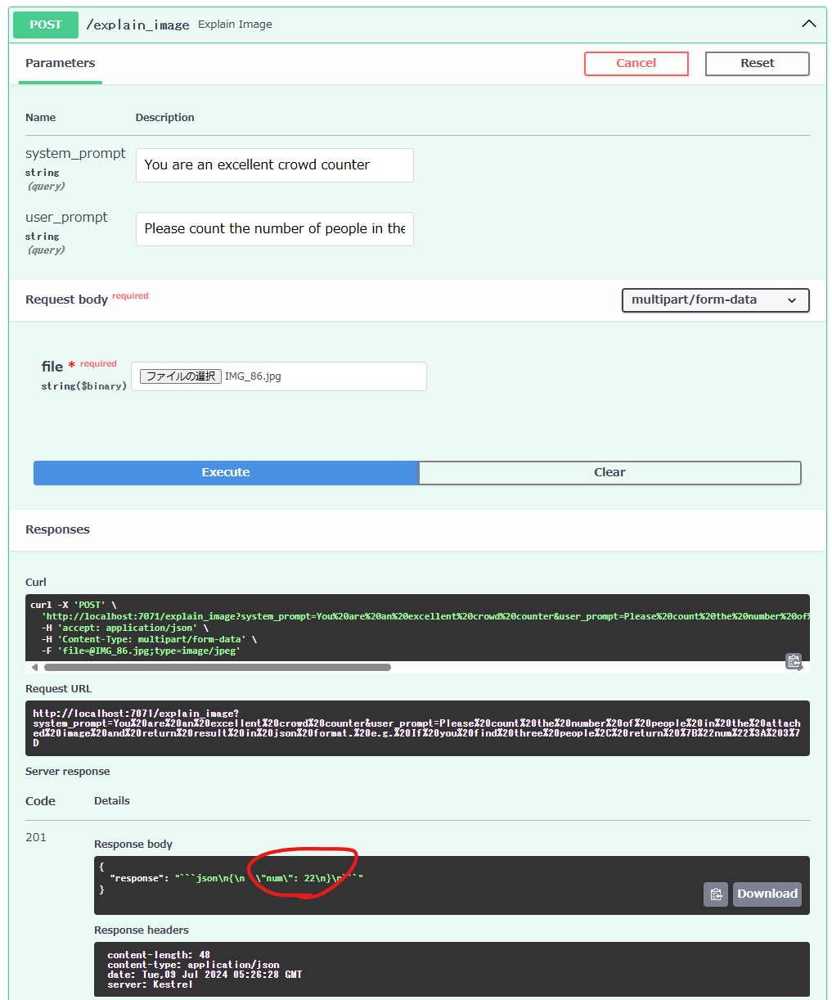

# iot-hub-messaging

Azure IoT Hub を使用して、IoT デバイスとクラウド間でメッセージの送受信を行います。

## アーキテクチャ図

[](./docs/images/architecture.png)

## インフラ構築

### 1. Azure リソースの作成

```shell
cd infra

# デプロイ
make deploy
```

### 2. 手動設定

#### デバイス ID の作成

[デバイス ID の作成と管理を行う](https://learn.microsoft.com/ja-jp/azure/iot-hub/create-connect-device?tabs=portal)を参考に、Azure Portal からデバイス ID を作成します。

デバイス側で実行するスクリプトとして [samples/async-hub-scenarios/receive_direct_method.py](https://github.com/Azure/azure-iot-sdk-python/blob/main/samples/async-hub-scenarios/receive_direct_method.py) を使用します。

発行したデバイス ID に対してダイレクトメソッドを呼び出して動作確認します。(動作確認のみであるためスキップしても問題ありません)

```shell
# Azure Portal からデバイス接続文字列を取得して環境変数に設定
export IOTHUB_DEVICE_CONNECTION_STRING="HostName=IOT_HUB_NAME.azure-devices.net;DeviceId={DEVICE_ID};SharedAccessKey={SHARED_ACCESS_KEY}"

# 仮想環境を作成
python -m venv .venv

# 仮想環境を有効化
source .venv/bin/activate

# パッケージのインストール
pip install azure-iot-device

# 依存関係の出力
# pip freeze > requirements.txt

# Direct Method の受信待ち
python receive_direct_method.py
```

デバイス側で受信待ちの状態になったら、Azure Portal からデバイスに対して direct method を送信します。

- [IoT Hub からのダイレクト メソッドの呼び出しについて](https://learn.microsoft.com/ja-jp/azure/iot-hub/iot-hub-devguide-direct-methods)

#### ファイルアップロード設定

[Azure IoT Hub を使用してデバイスからクラウドにファイルをアップロードする (Python) > IoT Hub への Azure Storage アカウントの関連付け](https://learn.microsoft.com/ja-jp/azure/iot-hub/file-upload-python#associate-an-azure-storage-account-to-iot-hub)を参考に IoT Hub と Azure Storage の関連付けを行います。

関連付けが完了したら、ファイルアップロードの動作確認を行います。(動作確認のみであるためスキップしても問題ありません)

```shell
# Azure Portal からデバイス接続文字列を取得して環境変数に設定
export IOTHUB_DEVICE_CONNECTION_STRING="HostName=IOT_HUB_NAME.azure-devices.net;DeviceId={DEVICE_ID};SharedAccessKey={SHARED_ACCESS_KEY}"

# 先程の仮想環境を有効化
source .venv/bin/activate

# パッケージの追加インストール
pip install azure.storage.blob

# 依存関係の出力
# pip freeze > requirements.txt

# Azure Storage Blob にファイルをアップロード
python upload_file.py
```

## エッジ側のスクリプト開発

opencv-python を使用して、カメラ画像を取得して Azure IoT Hub に送信するスクリプトを開発します。

```shell
# パッケージの追加インストール
pip install opencv-python

# 依存関係の出力
# pip freeze > requirements.txt

# カメラの動作確認のため実行 (動作確認のみであるためスキップしても問題ありません)
python capture_image.py
python show_video.py

# Azure Portal からデバイス接続文字列を取得して環境変数に設定
export IOTHUB_DEVICE_CONNECTION_STRING="HostName=IOT_HUB_NAME.azure-devices.net;DeviceId={DEVICE_ID};SharedAccessKey={SHARED_ACCESS_KEY}"
# PowerShell の場合
# $env:IOTHUB_DEVICE_CONNECTION_STRING="HostName=IOT_HUB_NAME.azure-devices.net;DeviceId={DEVICE_ID};SharedAccessKey={SHARED_ACCESS_KEY}"

# ファイルアップロード機能を実装したスクリプトを実行
python upload_image_direct_method.py
```

## Azure Functions 開発

- [クイックスタート: コマンド ラインから Azure に Python 関数を作成する](https://learn.microsoft.com/ja-jp/azure/azure-functions/create-first-function-cli-python?tabs=linux%2Cbash%2Cazure-cli%2Cbrowser)
- [Using FastAPI Framework with Azure Functions](https://learn.microsoft.com/en-us/samples/azure-samples/fastapi-on-azure-functions/fastapi-on-azure-functions/)

```shell
cd scenarios/2_iot-hub-messaging/functions/

# 仮想環境のセットアップ
python -m venv .venv
source .venv/bin/activate
pip install -r requirements.txt

# API サーバーのローカル実行
func start
# http://localhost:7071/docs にアクセスして動作確認
```

### Azure Functions へのデプロイ

```shell
cd scenarios/2_iot-hub-messaging/functions/

# Azure Functions へのデプロイ
bash deploy-azure-functions.sh
```

### 例: GPT-4o での画像認識

IoT デバイスから取得した画像に対して、GPT-4o を用いた画像認識を用いて群衆カウントを行う。
画像処理アルゴリズムを変更することなく、プロンプトの変更のみで簡単な試作が可能。
価値がありそうであればエッジでの画像処理や Azure AI 関連サービスを用いた画像認識を使ってみるなど。

- [Paper With Code > Crowd Counting](https://paperswithcode.com/task/crowd-counting)
- [Awesome-Crowd-Counting/src/Datasets.md](https://github.com/gjy3035/Awesome-Crowd-Counting/blob/master/src/Datasets.md)

**試行した例**

利用した画像:

[desenzhou/ShanghaiTechDataset](https://github.com/desenzhou/ShanghaiTechDataset) の `ShanghaiTech_Crowd_Counting_Dataset/part_B_final/train_data/images/IMG_86.jpg` を利用

[](./docs/images/crowd_counting_input.jpg)

以下のプロンプトで回答が 22 となった。

- `system_prompt`: "You are an excellent crowd counter",
- `user_prompt`: "Please count the number of people in the attached image and return result in json format. e.g. If you find three people, return {"num": 3}"

[](./docs/images/crowd_counting_result.png)

### Azure Cosmos DB へのデータ保存

Azure Portal から IoT Hub と Cosmos DB を関連付けて、IoT Hub からのデータを Cosmos DB に保存します。
IoT Hub からのデータを Cosmos DB に保存するため、[IoT Hub から Cosmos DB に直接データを送れるようになりました(パブリックプレビュー)](https://aadojo.alterbooth.com/entry/2022/12/08/154824) を参考に、`IoT Hub > Hub Settings > Message routing` から Endpoint と Route を設定します。

設定が反映されているかの動作確認のため、[クイック スタート:デバイスから IoT ハブに利用統計情報を送信して Azure CLI で監視する](https://learn.microsoft.com/ja-jp/azure/iot-hub/quickstart-send-telemetry-cli) を参考に、デバイスからメッセージを送信して Cosmos DB に保存されるか確認します。

```shell
DEVICE_NAME="your-device-name"
IOTHUB_NAME="your-iot-hub-name"

az iot device simulate -d $DEVICE_NAME -n $IOTHUB_NAME --mc 1
```

Data Explorer から Cosmos DB の指定の Container にデータが保存されているか確認します。

---

FIXME: [クイック スタート: Bicep を使用して Azure IoT ハブとストレージ アカウントをデプロイする](https://learn.microsoft.com/ja-jp/azure/iot-hub/quickstart-bicep-route-messages) を参考に、Bicep でのデプロイを行う。
