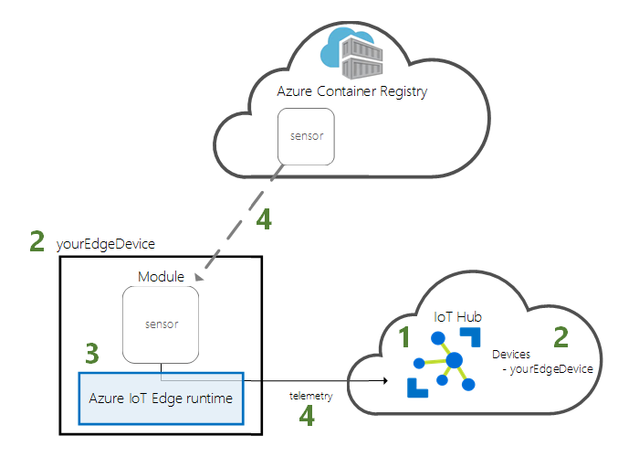

# iot-edge-messaging

Azure IoT Edge を使用して、エッジデバイスからクラウドへメッセージ送信します。

## アーキテクチャ図

[](./docs/images/architecture.png)

## インフラ構築

### 0. VM の接続設定

[main.parameters.bicepparam](./infra/main.parameters.bicepparam) に VM の接続設定を記述します。

```bicep
// cat ~/.ssh/id_rsa.pub
param vmAdminPasswordOrKey = '<ssh-public-key>'
```

### 1. Azure リソースの作成

```shell
cd infra

# デプロイ
make deploy
```

### 2. 手動設定

[デバイス ID の作成と管理を行う](https://learn.microsoft.com/ja-jp/azure/iot-hub/create-connect-device?tabs=portal)を参考に、Azure Portal からデバイス ID を作成し、接続文字列を取得します。

```shell
IOT_HUB_NAME="your-iot-hub-name"
DEVICE_ID="your-device-id"

# IoT Hub にデバイス ID を作成
az iot hub device-identity create \
    --device-id $DEVICE_ID \
    --hub-name $IOT_HUB_NAME \
    --edge-enabled

# IoT Edge デバイスの接続文字列を取得
DEVICE_CONNECTION_STRING=$(az iot hub device-identity \
    connection-string show --device-id $DEVICE_ID --hub-name $IOT_HUB_NAME -o tsv)
```

### 3. IoT Edge デバイスのセットアップ

- [Create and provision an IoT Edge device on Linux using symmetric keys](https://learn.microsoft.com/en-us/azure/iot-edge/how-to-provision-single-device-linux-symmetric?view=iotedge-1.4&tabs=azure-portal%2Cubuntu)
- [Azure/iotedge-vm-deploy](https://github.com/Azure/iotedge-vm-deploy)

```shell
# IoT Device (ここでは VM) に接続
DNS_NAME="your-dns-name"
ssh "azadmin@$DNS_NAME.japaneast.cloudapp.azure.com"

# IoT Edge ランタイムのインストール
sh ./scripts/install-iot-edge.sh
```

### 4. IoT Edge モジュールのデプロイ

- [クイック スタート:初めての IoT Edge モジュールを Linux 仮想デバイスにデプロイする > モジュールを展開する](https://learn.microsoft.com/ja-jp/azure/iot-edge/quickstart-linux?view=iotedge-1.5#deploy-a-module)

### 5. IoT Edge デバイスの監視

- [チュートリアル: IoT Edge デバイスを監視する](https://learn.microsoft.com/ja-jp/azure/iot-edge/tutorial-monitor-with-workbooks?view=iotedge-1.5)
